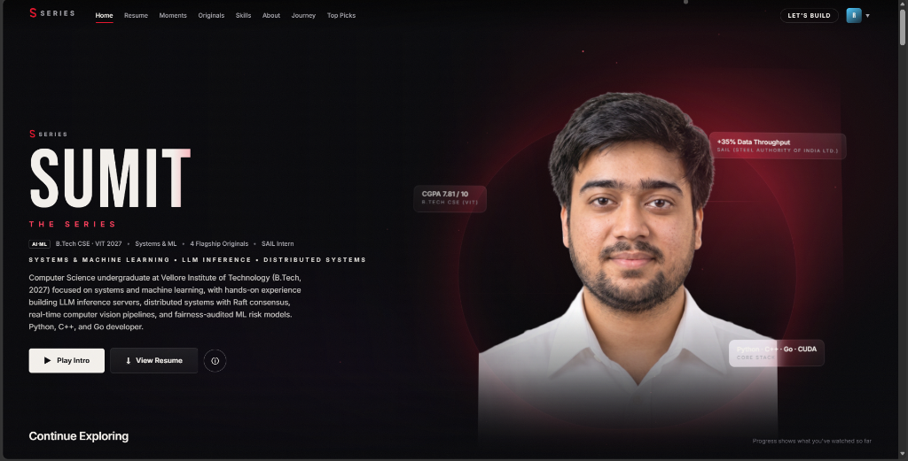
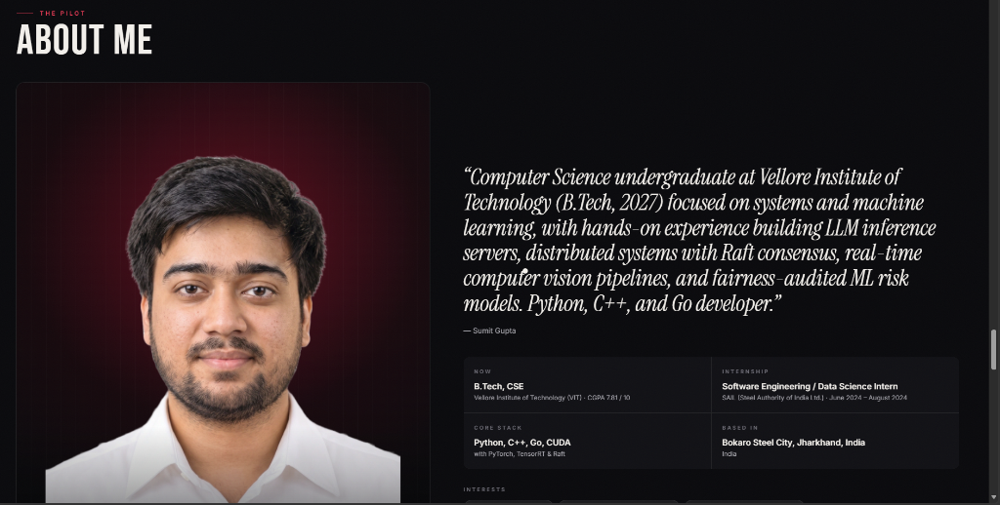
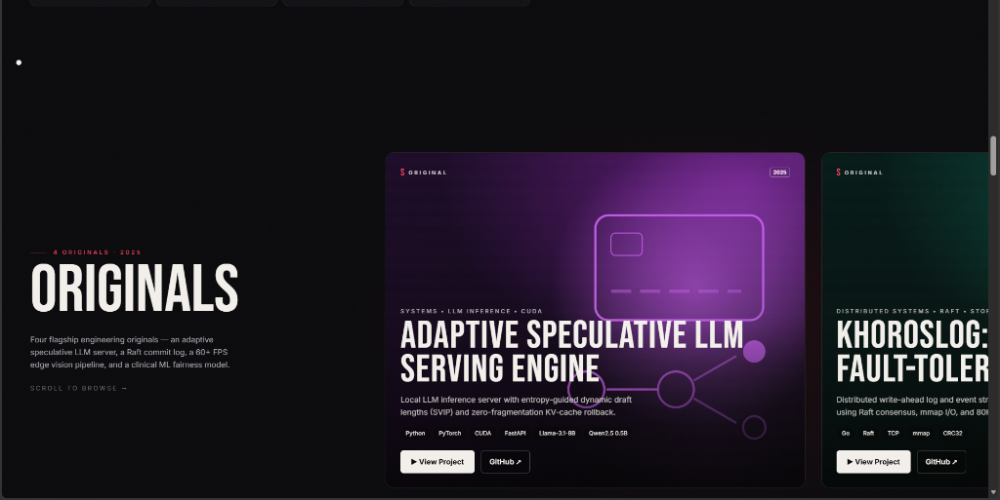
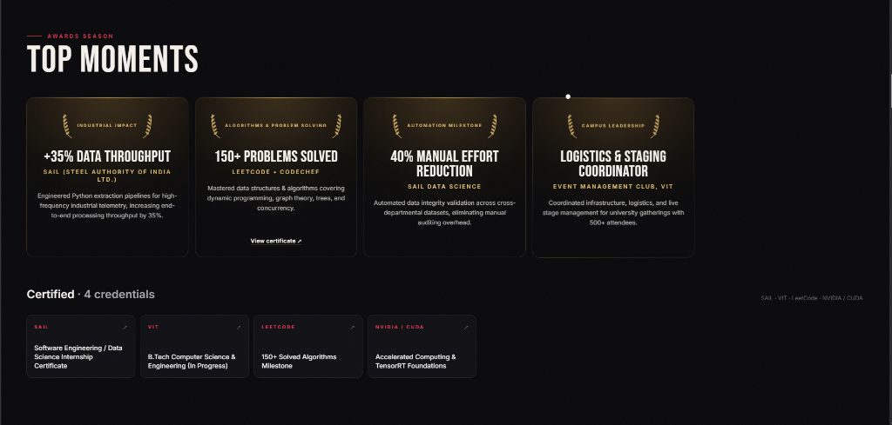
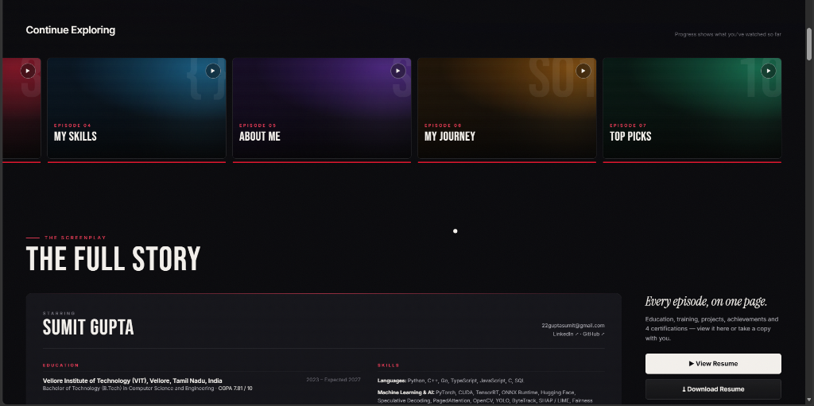
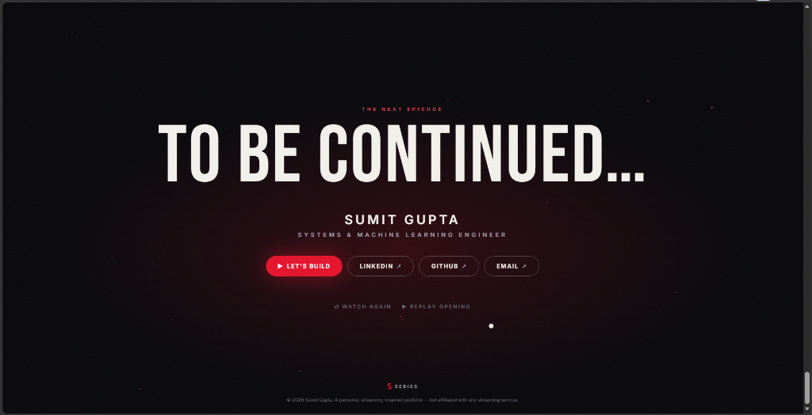

# 🎬 SUMIT — THE SERIES

<div align="center">

[](https://github.com/G1Z2P8I7/portfolio)
[](https://github.com/G1Z2P8I7/portfolio)
[](LICENSE)

<br/>

**A cinematic, streaming-inspired portfolio for [Sumit Gupta](https://linkedin.com/in/sumit-gupta-a2bbb1423)**  
*Systems & Machine Learning Engineer • B.Tech Computer Science (VIT Vellore)*  

Every section is an episode, every project is an Original, and the entire portfolio plays like a series.

[Explore Originals](#-the-originals) • [View Resume](#-the-screenplay--resume) • [Tech Stack](#-tech-stack) • [Quick Start](#-quick-start)

</div>

---

## 📽️ Visual Tour & Features

### 01. The Billboard & Studio Opening
> The signature studio card animates with letterbox bars (*"A GUPTA ORIGINAL"* &rarr; *"SUMIT — THE SERIES"*), leading into a dynamic billboard featuring a high-resolution transparent portrait with 3D pointer parallax, live telemetry chips, and ambient audio feedback.

<div align="center">
  
</div>

<br/>

### 02. The Pilot (About Me)
> The biographical story arc framed as an interactive 3D poster card, showcasing academic background at Vellore Institute of Technology, core stack, and industrial software engineering focus.

<div align="center">
  
</div>

<br/>

### 03. The Originals (Flagship Productions)
> Desktop-pinned horizontal scroll sequence and mobile swipe rail showcasing 4 high-concurrency engineering projects with deep-dive modal screenplays.

<div align="center">
  
</div>

<br/>

### 04. Top Moments & Certifications
> Laurel-wreath award posters celebrating verifiable milestones: +35% telemetry throughput at SAIL, 40% manual auditing reduction, and 150+ solved algorithmic problems on LeetCode & CodeChef.

<div align="center">
  
</div>

<br/>

### 05. The Screenplay (Full Resume)
> In-app collapsible resume sheet with synchronized metadata, printable PDF viewer, and direct one-click download for `Sumit_Gupta_Resume.pdf`.

<div align="center">
  
</div>

<br/>

### 06. To Be Continued (Contact & Finale)
> End-credits finale with interactive CTA buttons, quick social links (LinkedIn, GitHub, Email), and options to replay the opening sequence.

<div align="center">
  
</div>

---

## 🛠️ The Originals

| Title | Domain & Tech | Key Architectural Achievements |
| :--- | :--- | :--- |
| **Adaptive Speculative LLM Serving Engine** | `CUDA` `PyTorch` `Python` `FastAPI` `Llama-3.1-8B` | Built local inference server with entropy-guided dynamic draft lengths (SVIP), O(1) KV-cache rollback avoiding fragmentation on 8GB VRAM, and lossless verification. |
| **KhorosLog: Distributed Fault-Tolerant Commit Log** | `Go` `Raft` `TCP` `mmap` `CRC32` | Distributed write-ahead log & streaming engine with randomized election timers, leader failover under 150ms, memory-mapped page cache, and 80,000+ durable writes/sec. |
| **AegisVision: Real-Time Multi-Stream Vision Pipeline** | `C++` `Python` `TensorRT` `OpenCV` `WebRTC` | Video analytics processing 6 concurrent 1080p RTSP feeds at 60+ FPS using zero-copy POSIX shared memory, TensorRT FP16 dynamic batching on RTX 4060, and <80ms latency. |
| **ReadmitIQ: Hospital Readmission Risk Prediction** | `Python` `FastAPI` `Streamlit` `SHAP` `Equalized Odds` | 30-day clinical risk model on 69,987 patients with calibrated probabilities (ECE 0.0062), 1.73x top quintile risk lift, and Equalized Odds fairness auditing. |

---

## 💻 Tech Stack & Architecture

```
Core Framework:     React 18.3, TypeScript 5.8, Vite 6.3
Styling:            Tailwind CSS 4.1, PostCSS, Custom Design Tokens
Animation Engine:   Framer Motion 11.18 (LayoutGroup, Spring Physics, Parallax)
Smooth Scroll:      Lenis 1.1.20 (With Scroll-Lock Coordination)
Typography:         Bebas Neue (Display), Instrument Serif (Editorial), Inter (UI)
Media Optimization: Responsive WebP pipeline (Lanczos sampling, transparent alpha)
Document Reader:    Custom PDF embedding & ReportLab-generated resume
```

---

## 👤 Who's Watching? (Adaptive Perspectives)

The portfolio features an interactive profile selector that re-orders sections based on who is viewing:
- 💼 **Recruiter**: Prioritizes the Resume Screenplay, SAIL industry impact, and core metrics first.
- ⚡ **Systems Engineer**: Highlights *KhorosLog* (Go/Raft commit log) and *AegisVision* (C++/TensorRT) first.
- 🧠 **ML Researcher**: Highlights *Speculative LLM Serving* and *ReadmitIQ Fairness Auditing* first.
- 🎬 **Sumit (Main)**: The full chronological narrative experience.

---

## ⚡ Quick Start & Local Setup

### Prerequisites
- Node.js `18.x` or higher
- `npm` or `pnpm`

### Installation

```bash
# 1. Clone the repository
git clone https://github.com/G1Z2P8I7/portfolio.git
cd portfolio

# 2. Install dependencies
npm install

# 3. Start local development server
npm run dev
```

### Production Build

```bash
# Compile and package production static site
npm run build

# Preview locally
npm run preview
```

---

## 📄 License & Attribution

Designed and developed by **[Sumit Gupta](https://github.com/G1Z2P8I7)**. Built with high-performance modern web technologies.  
*A personal portfolio with a fictional streaming-platform aesthetic. Not affiliated with or endorsed by Netflix or any commercial streaming service.*
